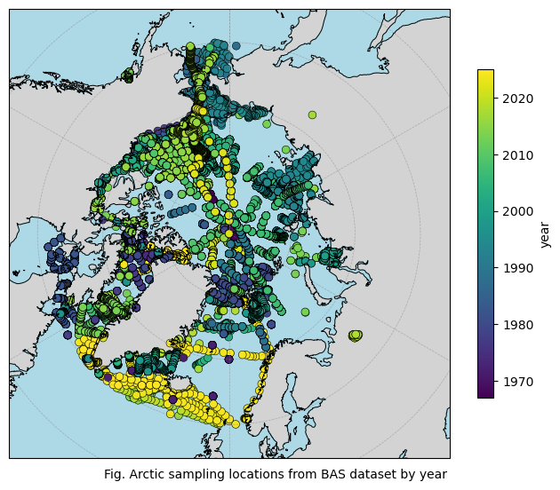
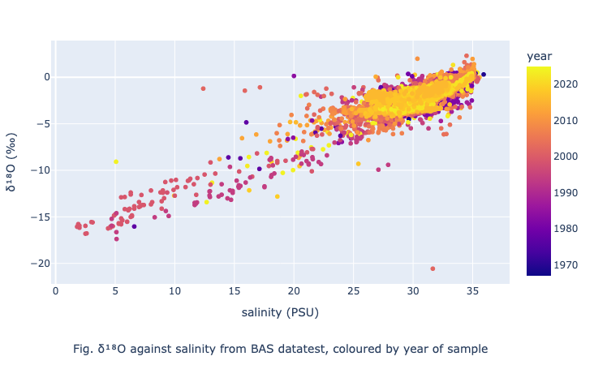

# Case Study: A spatially-complete $\delta ^{18}O$ dataset using Machine Learning methods

## 1. Introduction

The Arctic Ocean is one of the regions most strongly affected by climate change; it may be ice free in summer by the middle of the century. As the region warms, erosion of surrounding coasts is accelerating, changing the composition of material released into the ocean from rivers and glaciers and impacting the fragile Arctic ecosystems. Understanding how freshwater and riverborne nutrients enter the Arctic Ocean and where they go is vital to predict and plan for the consequences. Nature has provided us with a tool to do this. All water ($H_2O$) is composed of hydrogen ($H$) and oxygen ($O$). However, there is a variety (isotope) of oxygen (referred to as $^{18}O$) that is more common in seawater and sea ice (frozen seawater) than in rivers and glaciers. By mapping the relative abundance of $^{18}O$ (referred to as $\delta^{18}O$), we can see how freshwater, and the nutrients it may carry, move around and out of the Arctic.

This report outlines work done under WP2 of the AISIT project. A simple Machine Learning (ML) model is applied to data from the British Antarctic Survey (BAS), produced as part of WP1, to create a spatially-complete $\delta^{18}O$ dataset in the Arctic region. This is intended as a proof-of-concept, to motivate further work in this area such as the promotion of an AI challenge (as outlined in WP3). The results indicate that even a simple ML model produces useful, robust results and that further work in this area would provide important insight into the dynamics of freshwater in the Arctic region.

### 1.1. Installation

This repository is self-contained, with all code required to run the `case_study.ipynb` notebook in the `source` directory. All required dependencies are listed in `environment.yml`, which can be downloaded using `pip`. 

The data can be downloaded from the following:
* British Antarctic Survey $\delta^{18}O$ dataset: <insert link here>
* Arctic Ocean Reanalysis dataset: https://data.marine.copernicus.eu/product/ARCTIC_MULTIYEAR_PHY_002_003/files?subdataset=cmems_mod_arc_phy_my_topaz4_P1M_202506  

The `config.yaml` file indicates where in the directory the data is stored. BAS data is included as part of the repository; however, due to size restrictions, the AOR is not. The user can choose whether to download the data in the same form as displayed in the `config.yaml` file or to update the path in the file.

Note: It is not essential to use the AOR as the model on which the ML weights are applied. Any model can be used that has salinity, temperature and depth variables in the Arctic region.

## 2. Data

### 2.1. BAS dataset

The $\delta ^{18}O$ dataset has been generated by the BAS as part of WP1 of the AISIT project, bringing together a multitude of observational datasets. The columns that are relevant to this study are:

| Variable Name | Column Name |
|-----|-------------|
| latitude ($^oN$) | Latitude_[degN] |
| longitude ($^oE$) | Longitude_[degE] |
| temperature ($^oC$) | Temperature_[degC] |
| salinity (PSU) | CTD_Salinity_[standard_salinity_units] |
| depth (m) | combined_depth_[meters_below_surface] |
| $\delta^{18}O$ (‰) | DELO18_[permillle] |
| date | Sample_Date_[dd/mm/yyyy] |

Quality control (QC) is required to make the data ready for processing. Some values of salinity are very close to 0, which is unphysical. Addtionally, time columns are converted to a datetime, for easy use of `pandas` in-built datetime functions. Finally, all NaN values are dropped. If QC is performed on salinity, temperature and depth, 32.9% of the data is lost.

The data to see the sampling over the Arctic region. In this report, the sampling with respect to years is included; see the case_study.ipynb notebook for the equivalent plots for salinity, temperature and depth.

Generally, the coverage over the region is good, though there are clear regions where data is sparse. One can see that the majority of the early data is focussed around Greenland, whereas later data becomes more spread. The most modern data is focussed on the southern region between Greenland and Norway. Note that the majority of the data is collected at depths above 200m below sea surface. However, there are a few that reach up to 1000m.

It is worth noting that salinity exhibits the strongest relationship with $\delta^{18}O$, so this is the most important input variable to our model.

### 2.2. Arctic Ocean Reanalysis

The Arctic Ocean Reanalysis (AOR) is a coupled ocean–sea-ice data assimilation system that reconstructs the state of the Arctic Ocean by combining numerical modelling with satellite and in-situ observations. It is based on the Hybrid Coordinate Ocean Model (HYCOM) coupled with a dynamic sea-ice model and uses an ensemble Kalman filter to assimilate observations and produce gridded estimates of variables such as temperature and salinity. The dataset provides spatially and temporally continuous fields that are widely used to analyse Arctic ocean circulation, sea-ice variability, and climate change in a region with limited direct observations [Sakov 2012].

It is available from the Copernicus Marine Data Store [https://doi.org/10.48670/moi-00007] and was downloaded at daily, 1/12th-degree from January 1990 -- October 2025. The data has 40 depth layers and the variables relevant to this study is salinity (_so_) and temperature (_thetao_).

## 3. Using the model

### 3.1. The toy model

@Tom: can you fill in this section please?

### 3.2. Running the model

A random 10% subset of the dataset was withheld for validation, while the remaining 90% was used for model training. The temporal distribution of samples was examined to ensure that the training and validation subsets were representative of the overall dataset; most data is found in the summer months (June-September), when there are more ice-free regions. Training was performed on salinity, temperature and depth. Model performance evaluated against the withheld 10% validation data yielded a root mean square error (RMSE) of 0.405 and a coefficient of determination (R²) of 0.927. The distribution of absolute errors across the validation set showed percentiles (5th, 25th, 50th, 75th, 95th) of 0.009, 0.047, 0.122, 0.309, and 0.932, respectively.

Note that tests were run for different combinations of the input variables (salinity only, temperature only etc.) and it was found that, as expected, salinity yields the lowest RMSE and highest R² of the three. See Sec. 2.2 of the `case_study.ipynb` notebook for details.

The trained model produced a set of weights that were subsequently applied to the Arctic Ocean Reanalysis (AOR) dataset to get a spatially-complete, 1/12th-degree gridded dataset for $\delta^{18}O$ from 1990--2025 in the Arctic region. 

## 4. Model output

To preserve computational efficiency, the weights were applied to a portion of the AOR data: years 1994, 2007, 2012 and 2023 and depths 2, 10, 40, 100, 200, 400 metres. The years were chosen for their particularly high or low Arctic Ocean Oscillation (AOO) index, which measures the strength of the Arctic Ocean circulation, and thus the results should give distinct patterns of $\delta^{18}O$. The depths were chosen to give variety in the number of observations that can be compared with the results: near-surface has more data than deeper ocean. In general, these years and depths were chosen to check the robustness of the ML model.

As an example, $\delta^{18}O$ is plotted for September 1994 (low AOO) for the 6 depths:

The bluer regions indicate areas where the freshwater oxygen isotope is more prevalent and thus indicates sources of freshwater. 
@Yevgeny: do we want to add more science?

## 5. Testing the model

To test the robustness of the ML model, a subset of the BAS data is now dropped before training. For this report, the region (30W-50W, 75S-80S) is removed: an area that has a lot of data. The procedure outlined in Sec. 3.2 is then repeated. As an example, the difference between the subsetted model and the full model (plotted in Sec. 4) is shown for September 1994 at a depth of 10m.

Note that the `case_study.ipynb` notebook also explores the removal of a year of data. The model shows a similar robustness.

## 6. Conclusion

A simple linearised Machine Learning model has been applied to the BAS $\delta^{18}O$ dataset to produce a spatially-complete, 3-d $\delta^{18}O$ dataset based on the Arctic Ocean Reanalysis. The model performs well, with relatively low RMSE and high R², and has reasonable robustness when subsets of the data are removed. As a proof-of-concept, the results are encouraging and more work on using Machine Learning models to infill such datasets is warranted. 

## References 

[Sakov 2012]: Sakov, P., Counillon, F., Bertino, L., Lisæter, K. A., Oke, P. R., and Korablev, A.: TOPAZ4: an ocean-sea ice data assimilation system for the North Atlantic and Arctic, Ocean Sci., 8, 633–656, https://doi.org/10.5194/os-8-633-2012, 2012.
